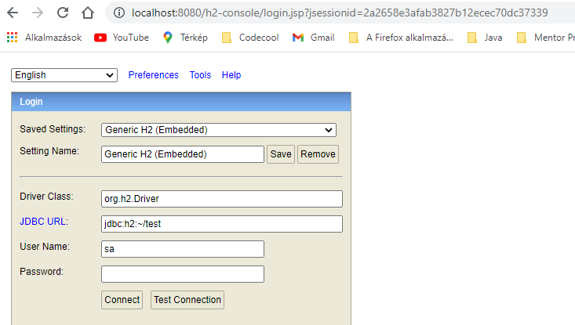
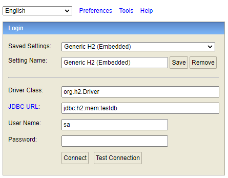
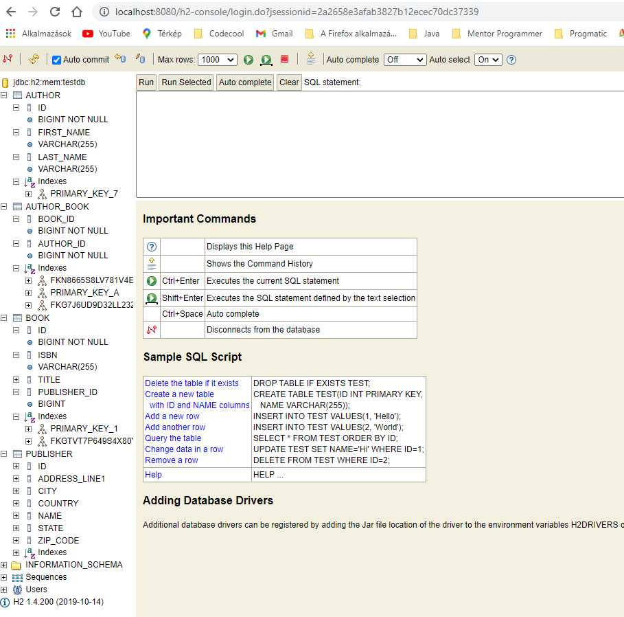
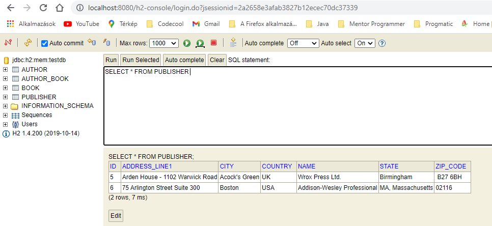

= Good to know!

== In general:

http://localhost:8080/h2-console/

== Set in application.properties (as far as default value is false!):

spring.h2.console.enabled=true

2021-10-04 17:42:13.976  INFO 17880 --- [           main] o.s.b.a.h2.H2ConsoleAutoConfiguration    : H2 console available at '/h2-console'. Database available at 'jdbc:h2:mem:testdb'

check if the url is the same as in your program! if not, change it!!! or you are not able to see anything of your tables!

and then click on connect!!! result see bellow, your whole database:

if you want to use, just click on PUBLISHER (it makes automatically the query ...) and click on run!

